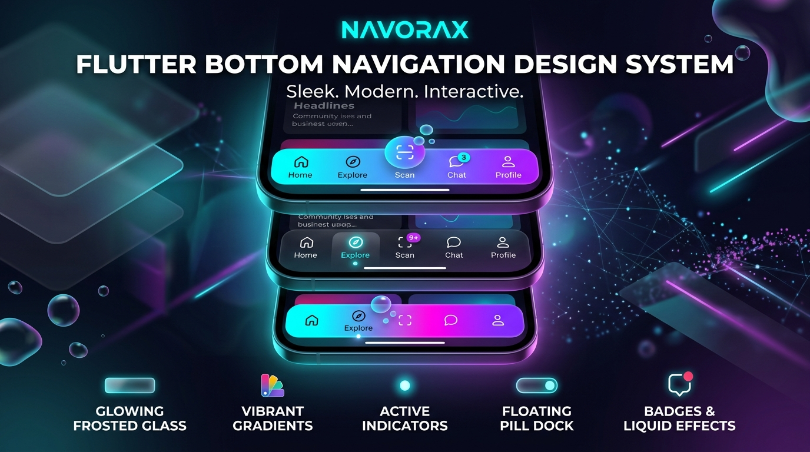

# NavoraX 🚀

### Complete, Production-Ready Bottom Navigation Design System for Flutter

[](https://pub.dev/packages/navorax)
[](https://flutter.dev)
[](LICENSE)
[](#1000-ready-made-templates)

> 🌐 **Interactive Web Documentation & Parameter Dictionary**:  
> 👉 Check out the live interactive documentation at [**NavoraX Documentation**](https://imcoderaditya.github.io/NavoraX/)!



**NavoraX** is an enterprise-grade, highly customizable **Bottom Navigation Design System** for Flutter. Rather than just offering a basic collection of static widgets, NavoraX provides a powerful **Navigation Engine**, **1000+ Template Registry**, **Navigation Composer (`NavoraXNavBuilder`)**, **Animation & Physics Engine**, **Adaptive Mobile Safe Area System**, **Context-Aware Navigation Controller**, and **Smart AI Generation** abstractions.

---

## ✨ Key Features

- 🎨 **1000+ Predefined Templates**: Instantly switch between Classic, Minimal, Glassmorphic, Neumorphic, Floating Dock, Curved Wave, Liquid Bubble, Cyberpunk Neon, Luxury Gold, E-Commerce, and FinTech designs.
- ⚡ **Navigation Composer (`NavoraXNavBuilder`)**: Fluent matrix composition system enabling millions of unique design combinations.
- 📱 **Mobile Safe Area & Gesture Bar Integration**: Automatic `MediaQuery` inset handling so navigation bars seamlessly float above or wrap around iOS Home Indicators and Android Gesture Bars.
- 🌙 **Adaptive & Performance Engine**: Automatic light/dark mode, OLED pitch black, tablet/desktop screen scaling, and low-power GPU blur optimization.
- 🧠 **Context-Aware State Control**: Dynamically alter layout, expand/compact states, or auto-hide navigation bars based on active app screens (Checkout, Video Player, Charging).
- 💧 **Liquid & Physics Animations**: Smooth morphing bezier curves, stretchy elastic bubbles, magnetic dock physics, and glowing neon effects.
- 🔘 **Notched FAB & Custom Center Actions**: Seamless support for center notched Floating Action Buttons (`NavoraXCenterAction`).
- 🏷️ **Animated Badge System**: Integrated count badges, pulse status dots, custom text tags, and custom badge widgets.
- 🤖 **Smart AI Generation**: Natural language prompt-driven navigation bar auto-generation (`NavoraXAI.generate()`).

---

## 📦 Installation

Add `navorax` to your `pubspec.yaml`:

```yaml
dependencies:
  navorax: ^1.0.0
```

Import NavoraX in your Dart code:

```dart
import 'package:navorax/navorax.dart';
```

---

## 🚀 Quickstart

### 1. Simple Implementation

```dart
NavoraX(
  currentIndex: _currentIndex,
  items: const [
    NavoraXItem(icon: Icons.home_outlined, activeIcon: Icons.home_rounded, label: 'Home'),
    NavoraXItem(icon: Icons.explore_outlined, activeIcon: Icons.explore_rounded, label: 'Discover'),
    NavoraXItem(icon: Icons.shopping_bag_outlined, activeIcon: Icons.shopping_bag_rounded, label: 'Cart', badge: NavoraXBadge(type: NavoraXBadgeType.count, count: 4)),
    NavoraXItem(icon: Icons.person_outline_rounded, activeIcon: Icons.person_rounded, label: 'Profile'),
  ],
  onChanged: (index) {
    setState(() => _currentIndex = index);
  },
)
```

### 2. Ready-Made Templates (1000+)

Select any of the 1000+ template configurations with a single line:

```dart
NavoraX(
  template: NavoraXTemplateEnum.glassMorph,
  currentIndex: _currentIndex,
  items: items,
  onChanged: onChanged,
)
```

### Primary Ready-to-Use Templates include:
| Template | Visual Style | Category |
| :--- | :--- | :--- |
| `NavoraXTemplateEnum.glassMorph` | Ultra Frosted Backdrop Blur | Glassmorphism |
| `NavoraXTemplateEnum.floatingPill` | Stretchy Floating Capsule Pill | Floating / Pill |
| `NavoraXTemplateEnum.liquid` | Liquid Bezier Morphing Flow | Liquid |
| `NavoraXTemplateEnum.dock` | macOS Glass Dock Bar | Dock |
| `NavoraXTemplateEnum.cyberpunk` | Asymmetric Cyber Neon Cyan/Magenta | Gaming / Cyberpunk |
| `NavoraXTemplateEnum.royalGold` | Onyx Black & Gold Leaf Luxury | Luxury |
| `NavoraXTemplateEnum.neumorphic` | Soft Neumorphic Dual Shadows | Neumorphism |
| `NavoraXTemplateEnum.centerFab` | Notched Floating Action Button Bar | Center FAB Notch |
| `NavoraXTemplateEnum.minimal` | Clean Minimalist Outlined | Minimal |
| `NavoraXTemplateEnum.smartAdaptive` | Automatic Light/Dark System | Adaptive |

---

## 🛠️ Navigation Composer (`NavoraXNavBuilder`)

Combine matrix properties to create unlimited custom navigation bar designs:

```dart
final customConfig = NavoraXNavBuilder()
  .shape(NavoraXShape.pill)
  .indicator(NavoraXIndicator.liquidBubble)
  .animation(NavoraXAnimation.elastic)
  .iconStyle(NavoraXIconStyle.animatedScale)
  .labelStyle(NavoraXLabelStyle.alwaysShow)
  .background(NavoraXBackgroundStyle.glassMorph)
  .backgroundColor(const Color(0x4012121E))
  .activeColor(const Color(0xFF00F2FE))
  .inactiveColor(const Color(0xFF6C757D))
  .height(68.0)
  .elevation(8.0)
  .blurAmount(24.0)
  .borderRadius(BorderRadius.circular(30))
  .margin(const EdgeInsets.symmetric(horizontal: 16, vertical: 12))
  .build();

NavoraX(
  config: customConfig,
  currentIndex: _currentIndex,
  items: items,
  onChanged: onChanged,
)
```

---

## 📐 Shape & Indicator Matrix Reference

### Navigation Shapes (`NavoraXShape`)
- `flat`: Full-width traditional edge-to-edge bar.
- `rounded`: Top rounded corner container.
- `floating`: Floating capsule inset from edges.
- `pill`: Stretchy rounded pill bar.
- `curved`: Smooth concave curved top geometry.
- `wave`: Dynamic sine wave top geometry.
- `notched`: Center FAB notch cutout.
- `liquid`: Morphing liquid bezier curve.
- `dock`: macOS floating glass dock bar.
- `capsule`, `stadium`, `hexagon`, `asymmetric`.

### Selection Indicators (`NavoraXIndicator`)
- `lineTop`: Sliding top accent bar.
- `lineBottom`: Sliding bottom underline.
- `dot`: Floating active dot indicator.
- `pill`: Sliding background active pill highlight.
- `ring`: Icon framing ring circle.
- `glow`: Neon radial glow behind active icon.
- `stretchy`: Elastic stretchy bar physics.
- `liquidBubble`: Morphing liquid bubble protrusion.
- `backgroundFill`: Full tab background fill transition.

---

## 💡 Advanced Usage

### 📱 Mobile Safe Area & Gesture Bar Padding

`NavoraX` handles iOS Home Indicator and Android Gesture Bar insets automatically out of the box (`useSafeArea: true`):

```dart
NavoraX(
  useSafeArea: true, // Automatically applies bottom inset padding
  currentIndex: _currentIndex,
  items: items,
  onChanged: onChanged,
)
```

### 🔘 Notched Center FAB Action

```dart
NavoraX(
  currentIndex: _currentIndex,
  template: NavoraXTemplateEnum.centerFab,
  centerAction: NavoraXCenterAction(
    icon: Icons.add,
    backgroundColor: const Color(0xFF6366F1),
    onTap: () => _showCreateModal(),
  ),
  items: items,
  onChanged: onChanged,
)
```

### 🧠 Context-Aware Screen Management

Change navigation state dynamically from anywhere in your app:

```dart
// 1. Enable context awareness in widget
NavoraX(
  contextAware: true,
  currentIndex: _currentIndex,
  items: items,
  onChanged: onChanged,
)

// 2. Set active context anywhere in app logic
NavoraXController.setContext(NavoraXContextMode.checkout); // Switches to compact checkout state
NavoraXController.setContext(NavoraXContextMode.hidden);   // Smoothly hides navigation bar
```

### 🤖 Smart AI Generation

Generate navigation configurations using natural language prompts:

```dart
final aiConfig = await NavoraXAI.generate("Frosted glass floating bar with cyan neon glow");

NavoraX(
  config: aiConfig,
  currentIndex: _currentIndex,
  items: items,
  onChanged: onChanged,
)
```

---

## 📱 Interactive Template Gallery App

Check out the `example/` directory for a full interactive demo application featuring:
- 🎨 **1000+ Template Gallery** with real-time search & category filters.
- 🎛️ **Interactive Navigation Composer** playground with live controls.
- 🌙 **Live Preview Screen** with Light / Dark / OLED dark mode switcher.
- 💻 **Code Generator** with one-click "Copy Implementation Code".

```bash
cd example
flutter run
```

---

## 🌐 Interactive HTML Web Documentation

For an interactive online parameter dictionary, full class hierarchy reference, live code generator, and search engine for all parameters:

👉 Check out the interactive documentation live at [**NavoraX Documentation**](https://imCoderAditya.github.io/NavoraX/)!

---

## 📄 License

This project is licensed under the MIT License - see the [LICENSE](LICENSE) file for details.
